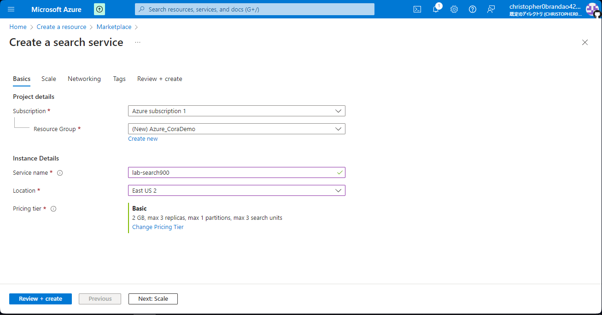
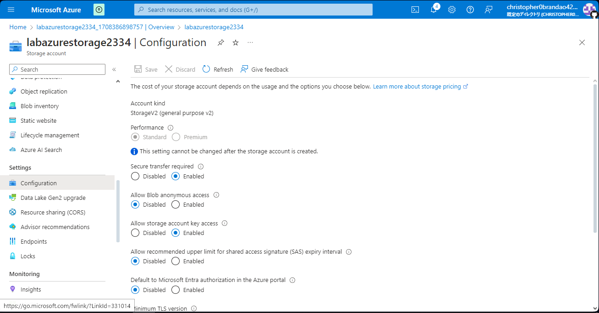

# dio_challenges_azure_documents
Project made during DIO's "Microsoft Azure AI Fundamentals" Bootcamp, under the section "Azure Cognitive Search: Utilizando AI Search para indexação e consulta de Dados"

Reference links:

- [Explore an Azure AI Search index (UI)](https://microsoftlearning.github.io/mslearn-ai-fundamentals/Instructions/Labs/11-ai-search.html)

## Followed step-by-step

1. Create an "Azure AI Search" resource

2. Fill in the necessary info, selecting pricing tier as "Basic", then click on "Review + create"

3. After finished validation, click on "Create"

4. Wait for the deployment
5. After successfully deploying the created resource, create a new "Azure AI services" resource

6. Fill in the necessary info, then click on "Review + create"

7. After finished validation, click on "Create"

8. Wait for the deployment
9. After successfully deploying the created resource, go back to Azure Portal then click on "Storage accounts"

10. Click on "Create"
11. While filling in the required fields, give a unique storage account name, select "Standard" as Performance and select "Locally-redundant storage (LRS)" as Redundancy
12. Click on "Review", then click on "Create"

13. Wait for the deployment
14. After finished deployment, click "Go to resource"

15. Go to "Settings" then "Configuration"

16. Toggle the option "Allow Blob anonymous access" to "Enabled" then click on "Save"
17. Go to "Data storage" then "Containers"

18. Click on "Container" then fill in the appropriate fields, selecting the proper anonymous access level

19. Click on "Create"
20. Open the container then click on "Upload"

21. Upload the files downloaded from [zipped coffee reviews link](https://aka.ms/mslearn-coffee-reviews). Note it's necessary to unzip them first

22. Go to your Azure AI search resource then click on "Import data"

23. Connect your uploaded data to the service, filling in the necessary configuration steps then clicking on "Submit"

24. Return to Azure AI Search home page then go to "Search explorer"
25. Select the index and make a search

**Noted points:** This solution can be put inside an application
